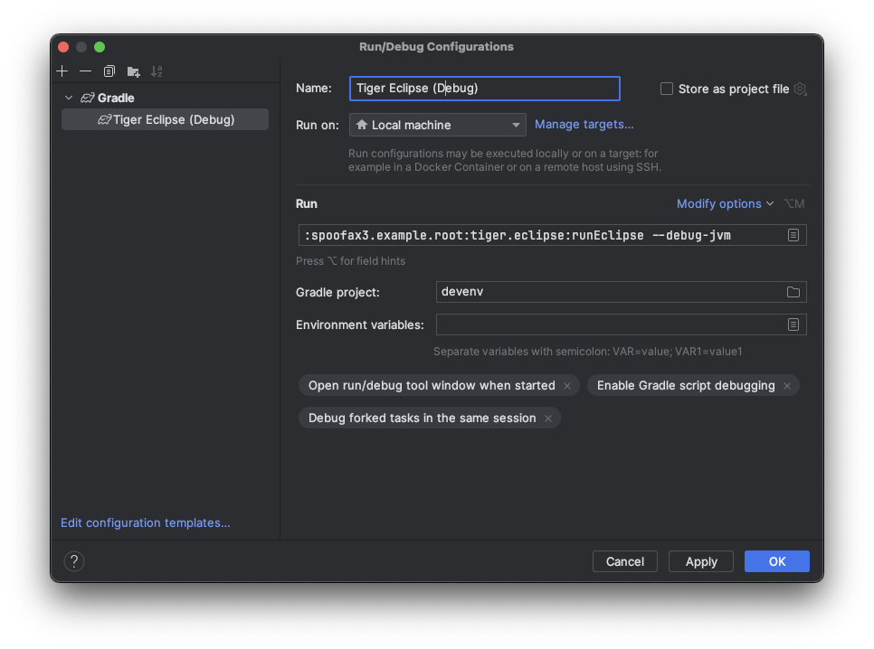

# How to debug Spoofax 3 development using IntelliJ
To debug Spoofax 3 development using IntelliJ, create a new Run Configuration and pass the `--debug-jvm` option to the task. For example:

```
:spoofax3.example.root:tiger.eclipse:runEclipse --debug-jvm
```



??? tip "Error: `Unknown command-line option '--debug-jvm'`"
    You specified the delegate task name (e.g., `runTigerEclipse`) instead of the full task name. Only the `JavaExec` type tasks support the `--debug-jvm` option, and the delegate tasks are of the wrong type. Specify the full task name instead. For example, if the delegate task `runTigerEclipse` is defined in the root `build.gradle.kts` like this:

    ```kotlin title="build.gradle.kts"
    tasksWithIncludedBuild("spoofax3.example.root") {
        registerDelegateTask("runTigerCli", it, ":tiger.cli:run")
        registerDelegateTask("runTigerEclipse", it, ":tiger.eclipse:runEclipse")
        registerDelegateTask("runTigerIntelliJ", it, ":tiger.intellij:runIde")
    }
    ```

    Then the full task name is the name of the included build combined with the name of the task, starting and separated with colons (`:`). Thus it would be:

    ```
    :spoofax3.example.root:tiger.eclipse:runEclipse
    ```

Then start the configuration in _Run_ mode, and wait until the following shows up in the console:

```
Listening for transport dt_socket at address: 5005 [Attach debugger]
```

Then click the <span class="guilabel">Attach debugger</span> text in the console to start and attach an external debugger and start debugging.


## Debugging tests
If you are debugging tests, make sure that the test results are cleaned before by running `cleanTest`, otherwise Gradle may skip the test task. For example, run the following Gradle tasks as part of the Run configuration:

```
:spoofax3.lwb.root:spoofax.dynamicloading:cleanTest :spoofax3.lwb.root:spoofax.dynamicloading:test
```


## What about `JAVA_TOOL_OPTIONS`?
Instead of specifying `--debug-jvm`, you can add the following configuration variable to your Run configuration:

```
JAVA_TOOL_OPTIONS=-agentlib:jdwp=transport=dt_socket,server=y,suspend=y,address=5005
```

This will work regardless of which task is specified, including specifying a delegate (non `JavaExec`) task.

However, note an important downside with this approach: this enables debugging for any Gradle task that executes Java in an isolated way, including any (Java/Kotlin) compilation tasks that run in a separate process. You might see the following error:

```
Picked up JAVA_TOOL_OPTIONS: -agentlib:jdwp=transport=dt_socket,server=y,suspend=y,address=5005
ERROR: transport error 202: bind failed: Address already in use
FATAL ERROR in native method: JDWP No transports initialized, jvmtiError=AGENT_ERROR_TRANSPORT_INIT(197)
ERROR: JDWP Transport dt_socket failed to initialize, TRANSPORT_INIT(510)
JDWP exit error AGENT_ERROR_TRANSPORT_INIT(197): No transports initialized [debugInit.c:750]
```

To avoid this error, make sure to first build normally such that these tasks are no longer executed, then run your debugging configuration.

