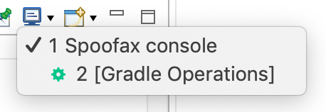

# Troubleshooting

This how-to guide explains how to troubleshoot issues when building and testing languages in the Spoofax Eclipse LWB plugin.
Try to resolve your problem by going through this guide from top to bottom.

## Looking for and solving errors

If something is not working as expected, the first thing to check is whether there are errors in the project by looking in the Project Explorer or Package Explorer view, which is open on the left-hand side of the IDE by default.
If there are any red markers on the project, or any directory or file in the project, that indicates an error.

When there are errors on files that define your language (e.g., .cfg/.sdf3/.stx/.str2 files), the language is not compiled and reloaded, so building the language has no effect, and your change will not be taken into account.
Errors on example and test (e.g., .spt) files are ok, and do not prevent the language from being compiled and reloaded.
If there are errors on language definition files, solve them build the language.

It is also possible to get a list of all the errors in the project by opening the Problems view. If this view is not open, open it by choosing Window ‣ Show view ‣ Problems from the main menu.

If there are errors in generated files (i.e., files in the `build/generated` directory), first try to build the language, as building the language may re-generate these files.
If the error persists, try deleting the generated file and then building the language.
Also consider [reporting this bug](../report_a_bug.md), as we consider incrementality issues like these bugs.

If after deleting the generated file and rebuilding the language, the generated file comes back with errors, definitely [report this as a bug](../report_a_bug.md).
You can try to look at the error in the generated file and see if you can solve it.

## Consulting the logs

Spoofax logs a lot of information to make troubleshooting easier.
First consult the Error Log view.
If this view is not open, open it by choosing Window ‣ Show view ‣ Error Log from the main menu.

The error log contains warning and error events from all plugins running in Eclipse, including several Spoofax plugins.
Browse through the errors from Spoofax plugins to see if it can help you troubleshoot the problem.

If nothing relevant is in the error log, try to consult the Console view.
If this view is not open, open it by choosing Window ‣ Show view ‣ Other...‣ search for Console, choose Console and open it from the main menu.

{ align=right width=250 }
If the console view does not say `Spoofax` in the top-left corner, ensure the `Spoofax` console is open by pressing the small downward error on the blue monitor icon and selecting `Spoofax console` (see screenshot).
Browse through the log from Spoofax plugins to see if it can help you troubleshoot the problem.

When building, Spoofax logs all tasks and files that are checked, and all tasks that are built.
At the end of the build, Spoofax logs whether it completed or if something went wrong.
Rebuild your language and check the build log to see if it can help you troubleshoot the problem.

If you ask for help or report a bug, consider storing the log in a text file, so you can include it in your help request or bug report.

## Cleaning the language project

Try cleaning the language project by first selecting (clicking) the language project in the Project Explorer or Package Explorer view, and then choosing Project ‣ Clean... from the main menu.
In the clean window, deselect Clean all projects, select your project, and press Clean.

Then, rebuild your language.
Optionally, check the error log and console again.

If this solves your problem, consider [reporting this bug](../report_a_bug.md), as we consider incrementality issues like these bugs.

## Deleting on-disk cache and restarting Eclipse

Finally, there may be a problem related to the on-disk cache.
First, close Eclipse.
Then, navigate to your workspace directory and delete the `.metadata/.plugins/spoofax.lwb.eclipse/pieStore` file.
These directories are hidden, so you may need to enable showing hidden files, or delete the file using your terminal.

Then, start Eclipse again and build your language.
Optionally, check the error log and console again.

If this solves your problem, consider [reporting this bug](../report_a_bug.md), as we consider incrementality issues like these bugs.

## Ask for help

If after troubleshooting the issue is not resolved, [ask for help](../ask_for_help.md).
